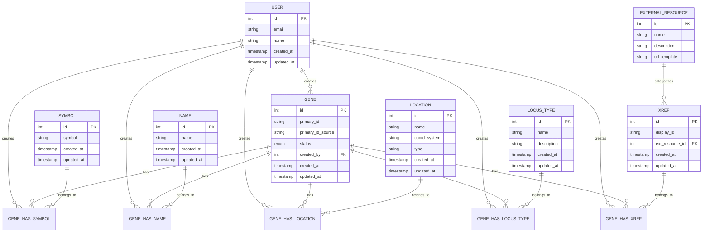

# Database Schema Documentation

## 🗃️ Database Schema Overview

The PGNC External Stack uses a PostgreSQL database to store plant gene nomenclature data. The schema is designed to handle complex relationships between genes, symbols, names, locations, and cross-references while maintaining data integrity and supporting efficient queries.

## 📊 Entity Relationship Diagram



## 🏗️ Core Tables

### 1. Gene Table

The central entity representing plant genes.

```sql
CREATE TABLE gene (
    id SERIAL PRIMARY KEY,
    primary_id VARCHAR(100) NOT NULL,
    primary_id_source VARCHAR(50) NOT NULL,
    status gene_status_enum NOT NULL DEFAULT 'internal',
    created_by INTEGER NOT NULL REFERENCES "user"(id),
    created_at TIMESTAMP NOT NULL DEFAULT NOW(),
    updated_at TIMESTAMP NOT NULL DEFAULT NOW(),
    
    CONSTRAINT gene_primary_id_source_unique UNIQUE (primary_id, primary_id_source)
);

CREATE INDEX idx_gene_primary_id ON gene(primary_id);
CREATE INDEX idx_gene_status ON gene(status);
CREATE INDEX idx_gene_created_by ON gene(created_by);
```

**Key Fields:**
- `primary_id`: Unique identifier within source (e.g., "Phytozome.1.1")
- `primary_id_source`: Source database identifier (e.g., "phytozome")
- `status`: Gene approval status (internal, approved, withdrawn)
- `created_by`: Reference to user who created the record

### 2. Symbol Table

Stores gene symbols (short identifiers).

```sql
CREATE TABLE symbol (
    id SERIAL PRIMARY KEY,
    symbol VARCHAR(50) NOT NULL UNIQUE,
    created_at TIMESTAMP NOT NULL DEFAULT NOW(),
    updated_at TIMESTAMP NOT NULL DEFAULT NOW()
);

CREATE INDEX idx_symbol_symbol ON symbol(symbol);
```

### 3. Name Table

Stores gene names (descriptive names).

```sql
CREATE TABLE name (
    id SERIAL PRIMARY KEY,
    name TEXT NOT NULL UNIQUE,
    created_at TIMESTAMP NOT NULL DEFAULT NOW(),
    updated_at TIMESTAMP NOT NULL DEFAULT NOW()
);

CREATE INDEX idx_name_name ON name(name);
```

### 4. Location Table

Stores chromosomal and genomic location information.

```sql
CREATE TABLE location (
    id SERIAL PRIMARY KEY,
    name VARCHAR(50) NOT NULL,
    coord_system VARCHAR(50) NOT NULL DEFAULT 'chromosome',
    type VARCHAR(50) NOT NULL DEFAULT 'primary assembly',
    created_at TIMESTAMP NOT NULL DEFAULT NOW(),
    updated_at TIMESTAMP NOT NULL DEFAULT NOW(),
    
    CONSTRAINT location_unique UNIQUE (name, coord_system, type)
);

CREATE INDEX idx_location_name ON location(name);
CREATE INDEX idx_location_coord_system ON location(coord_system);
```

### 5. Locus Type Table

Stores gene type classifications.

```sql
CREATE TABLE locus_type (
    id SERIAL PRIMARY KEY,
    name VARCHAR(100) NOT NULL UNIQUE,
    description TEXT,
    created_at TIMESTAMP NOT NULL DEFAULT NOW(),
    updated_at TIMESTAMP NOT NULL DEFAULT NOW()
);

-- Seed data for common locus types
INSERT INTO locus_type (name, description) VALUES
    ('protein-coding', 'Genes that encode proteins'),
    ('pseudogene', 'Non-functional gene copies'),
    ('lncRNA', 'Long non-coding RNA genes'),
    ('miRNA', 'MicroRNA genes'),
    ('rRNA', 'Ribosomal RNA genes'),
    ('tRNA', 'Transfer RNA genes');
```

### 6. Cross-Reference Tables

#### External Resource Table

```sql
CREATE TABLE external_resource (
    id SERIAL PRIMARY KEY,
    name VARCHAR(100) NOT NULL UNIQUE,
    description TEXT,
    url_template VARCHAR(500)
);

-- Seed data for external resources
INSERT INTO external_resource (id, name, description, url_template) VALUES
    (1, 'NCBI Gene', 'NCBI Gene database', 'https://www.ncbi.nlm.nih.gov/gene/{id}'),
    (2, 'Ensembl', 'Ensembl genome browser', 'https://plants.ensembl.org/id/{id}'),
    (3, 'UniProt', 'Universal Protein Resource', 'https://www.uniprot.org/uniprot/{id}'),
    (4, 'PubMed', 'PubMed literature database', 'https://pubmed.ncbi.nlm.nih.gov/{id}');
```

#### Cross-Reference Table

```sql
CREATE TABLE xref (
    id SERIAL PRIMARY KEY,
    display_id VARCHAR(100) NOT NULL,
    ext_resource_id INTEGER NOT NULL REFERENCES external_resource(id),
    created_at TIMESTAMP NOT NULL DEFAULT NOW(),
    updated_at TIMESTAMP NOT NULL DEFAULT NOW(),
    
    CONSTRAINT xref_unique UNIQUE (display_id, ext_resource_id)
);

CREATE INDEX idx_xref_display_id ON xref(display_id);
CREATE INDEX idx_xref_ext_resource_id ON xref(ext_resource_id);
```

## 🔗 Relationship Tables

### 1. Gene-Symbol Relationships

```sql
CREATE TABLE gene_has_symbol (
    gene_id INTEGER NOT NULL REFERENCES gene(id) ON DELETE CASCADE,
    symbol_id INTEGER NOT NULL REFERENCES symbol(id) ON DELETE CASCADE,
    type nomenclature_enum NOT NULL,
    status basic_status_enum NOT NULL DEFAULT 'public',
    created_by INTEGER NOT NULL REFERENCES "user"(id),
    created_at TIMESTAMP NOT NULL DEFAULT NOW(),
    updated_at TIMESTAMP NOT NULL DEFAULT NOW(),
    
    PRIMARY KEY (gene_id, symbol_id, type),
    CONSTRAINT gene_symbol_approved_unique UNIQUE (gene_id, type) 
        DEFERRABLE INITIALLY DEFERRED
);

CREATE INDEX idx_gene_has_symbol_gene_id ON gene_has_symbol(gene_id);
CREATE INDEX idx_gene_has_symbol_symbol_id ON gene_has_symbol(symbol_id);
CREATE INDEX idx_gene_has_symbol_type ON gene_has_symbol(type);
```

### 2. Gene-Name Relationships

```sql
CREATE TABLE gene_has_name (
    gene_id INTEGER NOT NULL REFERENCES gene(id) ON DELETE CASCADE,
    name_id INTEGER NOT NULL REFERENCES name(id) ON DELETE CASCADE,
    type nomenclature_enum NOT NULL,
    status basic_status_enum NOT NULL DEFAULT 'public',
    created_by INTEGER NOT NULL REFERENCES "user"(id),
    created_at TIMESTAMP NOT NULL DEFAULT NOW(),
    updated_at TIMESTAMP NOT NULL DEFAULT NOW(),
    
    PRIMARY KEY (gene_id, name_id, type),
    CONSTRAINT gene_name_approved_unique UNIQUE (gene_id, type)
        DEFERRABLE INITIALLY DEFERRED
);

CREATE INDEX idx_gene_has_name_gene_id ON gene_has_name(gene_id);
CREATE INDEX idx_gene_has_name_name_id ON gene_has_name(name_id);
CREATE INDEX idx_gene_has_name_type ON gene_has_name(type);
```

### 3. Gene-Location Relationships

```sql
CREATE TABLE gene_has_location (
    gene_id INTEGER NOT NULL REFERENCES gene(id) ON DELETE CASCADE,
    location_id INTEGER NOT NULL REFERENCES location(id) ON DELETE CASCADE,
    status basic_status_enum NOT NULL DEFAULT 'public',
    created_by INTEGER NOT NULL REFERENCES "user"(id),
    created_at TIMESTAMP NOT NULL DEFAULT NOW(),
    updated_at TIMESTAMP NOT NULL DEFAULT NOW(),
    
    PRIMARY KEY (gene_id, location_id)
);

CREATE INDEX idx_gene_has_location_gene_id ON gene_has_location(gene_id);
CREATE INDEX idx_gene_has_location_location_id ON gene_has_location(location_id);
```

### 4. Gene-Locus Type Relationships

```sql
CREATE TABLE gene_has_locus_type (
    gene_id INTEGER NOT NULL REFERENCES gene(id) ON DELETE CASCADE,
    locus_type_id INTEGER NOT NULL REFERENCES locus_type(id) ON DELETE CASCADE,
    status basic_status_enum NOT NULL DEFAULT 'public',
    created_by INTEGER NOT NULL REFERENCES "user"(id),
    created_at TIMESTAMP NOT NULL DEFAULT NOW(),
    updated_at TIMESTAMP NOT NULL DEFAULT NOW(),
    
    PRIMARY KEY (gene_id, locus_type_id)
);

CREATE INDEX idx_gene_has_locus_type_gene_id ON gene_has_locus_type(gene_id);
CREATE INDEX idx_gene_has_locus_type_locus_type_id ON gene_has_locus_type(locus_type_id);
```

### 5. Gene-Cross-Reference Relationships

```sql
CREATE TABLE gene_has_xref (
    gene_id INTEGER NOT NULL REFERENCES gene(id) ON DELETE CASCADE,
    xref_id INTEGER NOT NULL REFERENCES xref(id) ON DELETE CASCADE,
    source VARCHAR(50) NOT NULL DEFAULT 'curator',
    status basic_status_enum NOT NULL DEFAULT 'public',
    created_by INTEGER NOT NULL REFERENCES "user"(id),
    created_at TIMESTAMP NOT NULL DEFAULT NOW(),
    updated_at TIMESTAMP NOT NULL DEFAULT NOW(),
    
    PRIMARY KEY (gene_id, xref_id)
);

CREATE INDEX idx_gene_has_xref_gene_id ON gene_has_xref(gene_id);
CREATE INDEX idx_gene_has_xref_xref_id ON gene_has_xref(xref_id);
CREATE INDEX idx_gene_has_xref_source ON gene_has_xref(source);
```

## 🏷️ Enumeration Types

### 1. Gene Status Enumeration

```sql
CREATE TYPE gene_status_enum AS ENUM (
    'internal',    -- Gene exists but not public
    'approved',    -- Gene is publicly approved
    'withdrawn'    -- Gene has been withdrawn
);
```

### 2. Nomenclature Type Enumeration

```sql
CREATE TYPE nomenclature_enum AS ENUM (
    'approved',    -- Official approved nomenclature
    'alias',       -- Alternative nomenclature
    'previous'     -- Previously used nomenclature
);
```

### 3. Basic Status Enumeration

```sql
CREATE TYPE basic_status_enum AS ENUM (
    'public',      -- Publicly visible
    'private',     -- Internal/private
    'pending'      -- Pending approval
);
```

## 👤 User Management

### User Table

```sql
CREATE TABLE "user" (
    id SERIAL PRIMARY KEY,
    email VARCHAR(255) NOT NULL UNIQUE,
    name VARCHAR(255) NOT NULL,
    is_active BOOLEAN NOT NULL DEFAULT TRUE,
    created_at TIMESTAMP NOT NULL DEFAULT NOW(),
    updated_at TIMESTAMP NOT NULL DEFAULT NOW()
);

CREATE INDEX idx_user_email ON "user"(email);
CREATE INDEX idx_user_is_active ON "user"(is_active);

-- Seed data for system users
INSERT INTO "user" (email, name) VALUES
    ('sart2@cam.ac.uk', 'System Administrator'),
    ('curator@pgnc.org', 'PGNC Curator');
```

## 🔍 Common Queries

### 1. Get Gene with All Associated Data

```sql
-- Get complete gene information
SELECT 
    g.primary_id,
    g.primary_id_source,
    g.status,
    s.symbol,
    ghs.type as symbol_type,
    n.name,
    ghn.type as name_type,
    l.name as chromosome,
    lt.name as locus_type,
    er.name as xref_source,
    x.display_id as xref_id
FROM gene g
LEFT JOIN gene_has_symbol ghs ON g.id = ghs.gene_id
LEFT JOIN symbol s ON ghs.symbol_id = s.id
LEFT JOIN gene_has_name ghn ON g.id = ghn.gene_id
LEFT JOIN name n ON ghn.name_id = n.id
LEFT JOIN gene_has_location ghl ON g.id = ghl.gene_id
LEFT JOIN location l ON ghl.location_id = l.id
LEFT JOIN gene_has_locus_type ghlt ON g.id = ghlt.gene_id
LEFT JOIN locus_type lt ON ghlt.locus_type_id = lt.id
LEFT JOIN gene_has_xref ghx ON g.id = ghx.gene_id
LEFT JOIN xref x ON ghx.xref_id = x.id
LEFT JOIN external_resource er ON x.ext_resource_id = er.id
WHERE g.primary_id = 'Phytozome.1.1';
```

### 2. Find Genes by Symbol

```sql
-- Find genes by symbol (approved or alias)
SELECT DISTINCT 
    g.primary_id,
    g.status,
    s.symbol,
    ghs.type
FROM gene g
JOIN gene_has_symbol ghs ON g.id = ghs.gene_id
JOIN symbol s ON ghs.symbol_id = s.id
WHERE s.symbol ILIKE '%SYMBOL1%'
  AND g.status = 'approved'
ORDER BY g.primary_id;
```

### 3. Get Genes by Chromosome

```sql
-- Find all genes on a specific chromosome
SELECT 
    g.primary_id,
    l.name as chromosome,
    lt.name as locus_type
FROM gene g
JOIN gene_has_location ghl ON g.id = ghl.gene_id
JOIN location l ON ghl.location_id = l.id
JOIN gene_has_locus_type ghlt ON g.id = ghlt.gene_id
JOIN locus_type lt ON ghlt.locus_type_id = lt.id
WHERE l.name = '1'
  AND l.coord_system = 'chromosome'
  AND g.status = 'approved'
ORDER BY g.primary_id;
```

### 4. Cross-Reference Lookup

```sql
-- Find genes by external database ID
SELECT 
    g.primary_id,
    er.name as database_name,
    x.display_id
FROM gene g
JOIN gene_has_xref ghx ON g.id = ghx.gene_id
JOIN xref x ON ghx.xref_id = x.id
JOIN external_resource er ON x.ext_resource_id = er.id
WHERE x.display_id = 'NCBI123'
  AND er.name = 'NCBI Gene';
```

## ⚡ Performance Optimization

### 1. Essential Indexes

```sql
-- Gene table indexes
CREATE INDEX idx_gene_primary_id ON gene(primary_id);
CREATE INDEX idx_gene_status ON gene(status);
CREATE INDEX idx_gene_compound ON gene(primary_id, primary_id_source);

-- Symbol and Name indexes
CREATE INDEX idx_symbol_symbol_trgm ON symbol USING gin(symbol gin_trgm_ops);
CREATE INDEX idx_name_name_trgm ON name USING gin(name gin_trgm_ops);

-- Relationship table indexes
CREATE INDEX idx_gene_has_symbol_gene_type ON gene_has_symbol(gene_id, type);
CREATE INDEX idx_gene_has_name_gene_type ON gene_has_name(gene_id, type);

-- Cross-reference indexes
CREATE INDEX idx_xref_display_ext ON xref(display_id, ext_resource_id);
```

### 2. Materialized Views for Complex Queries

```sql
-- Materialized view for gene summary information
CREATE MATERIALIZED VIEW gene_summary AS
SELECT 
    g.id,
    g.primary_id,
    g.primary_id_source,
    g.status,
    s_approved.symbol as approved_symbol,
    n_approved.name as approved_name,
    l.name as chromosome,
    lt.name as locus_type,
    g.updated_at
FROM gene g
LEFT JOIN gene_has_symbol ghs_approved ON (
    g.id = ghs_approved.gene_id 
    AND ghs_approved.type = 'approved'
)
LEFT JOIN symbol s_approved ON ghs_approved.symbol_id = s_approved.id
LEFT JOIN gene_has_name ghn_approved ON (
    g.id = ghn_approved.gene_id 
    AND ghn_approved.type = 'approved'
)
LEFT JOIN name n_approved ON ghn_approved.name_id = n_approved.id
LEFT JOIN gene_has_location ghl ON g.id = ghl.gene_id
LEFT JOIN location l ON ghl.location_id = l.id
LEFT JOIN gene_has_locus_type ghlt ON g.id = ghlt.gene_id
LEFT JOIN locus_type lt ON ghlt.locus_type_id = lt.id;

CREATE UNIQUE INDEX idx_gene_summary_id ON gene_summary(id);
CREATE INDEX idx_gene_summary_primary_id ON gene_summary(primary_id);
CREATE INDEX idx_gene_summary_symbol ON gene_summary(approved_symbol);
```

### 3. Partitioning Strategy

For large datasets, consider partitioning by gene status or source:

```sql
-- Partition genes by status
CREATE TABLE gene_approved PARTITION OF gene 
FOR VALUES IN ('approved');

CREATE TABLE gene_internal PARTITION OF gene 
FOR VALUES IN ('internal');

CREATE TABLE gene_withdrawn PARTITION OF gene 
FOR VALUES IN ('withdrawn');
```

## 🔒 Data Integrity Constraints

### 1. Business Rules

```sql
-- Ensure each gene has at most one approved symbol
ALTER TABLE gene_has_symbol 
ADD CONSTRAINT gene_symbol_approved_unique 
UNIQUE (gene_id, type) DEFERRABLE INITIALLY DEFERRED;

-- Ensure each gene has at most one approved name
ALTER TABLE gene_has_name 
ADD CONSTRAINT gene_name_approved_unique 
UNIQUE (gene_id, type) DEFERRABLE INITIALLY DEFERRED;

-- Ensure primary_id uniqueness within source
ALTER TABLE gene 
ADD CONSTRAINT gene_primary_id_source_unique 
UNIQUE (primary_id, primary_id_source);
```

### 2. Triggers for Audit Trail

```sql
-- Function to update updated_at timestamp
CREATE OR REPLACE FUNCTION update_updated_at_column()
RETURNS TRIGGER AS $$
BEGIN
    NEW.updated_at = NOW();
    RETURN NEW;
END;
$$ language 'plpgsql';

-- Apply to all tables with updated_at column
CREATE TRIGGER update_gene_updated_at 
    BEFORE UPDATE ON gene 
    FOR EACH ROW EXECUTE FUNCTION update_updated_at_column();

CREATE TRIGGER update_symbol_updated_at 
    BEFORE UPDATE ON symbol 
    FOR EACH ROW EXECUTE FUNCTION update_updated_at_column();

-- Add similar triggers for other tables...
```

## 🔧 Database Maintenance

### 1. Regular Maintenance Tasks

```sql
-- Update table statistics
ANALYZE gene;
ANALYZE symbol;
ANALYZE name;

-- Refresh materialized views
REFRESH MATERIALIZED VIEW CONCURRENTLY gene_summary;

-- Vacuum tables to reclaim space
VACUUM (ANALYZE) gene;
VACUUM (ANALYZE) symbol;
VACUUM (ANALYZE) name;
```

### 2. Backup Strategy

```sql
-- Full database backup
pg_dump -h localhost -U postgres -d pgnc_db > backup_full.sql

-- Schema-only backup
pg_dump -h localhost -U postgres -d pgnc_db --schema-only > schema_backup.sql

-- Data-only backup
pg_dump -h localhost -U postgres -d pgnc_db --data-only > data_backup.sql
```

This database schema is designed to be scalable, maintainable, and efficient for the complex relationships inherent in gene nomenclature data while supporting the high-performance requirements of the PGNC system.
