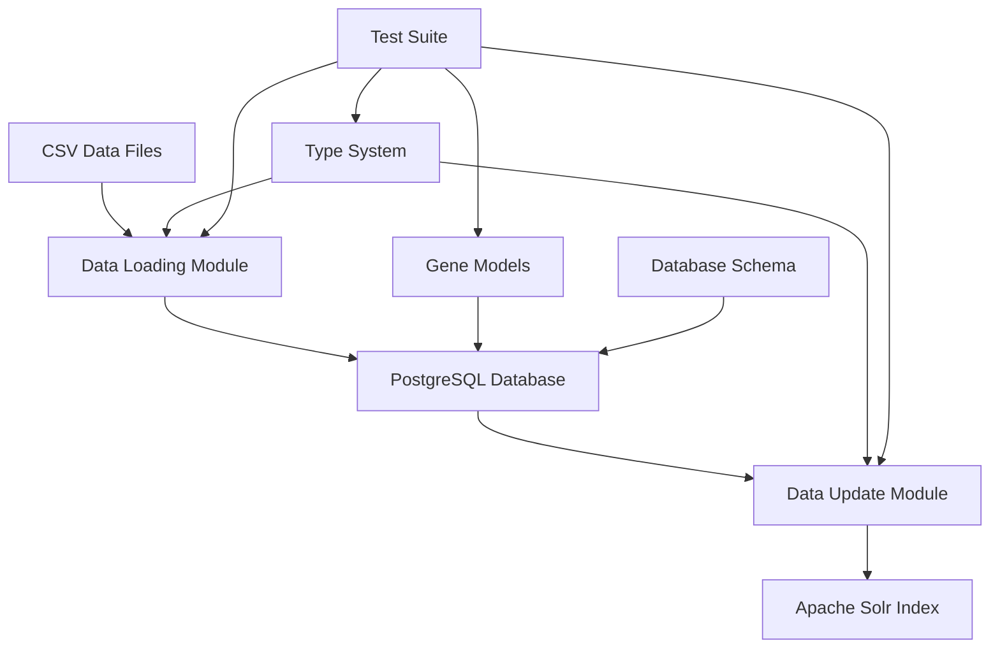

# PGNC External Stack - Python Project Documentation

## 🌱 Project Overview

The PGNC (Plant Gene Nomenclature Committee) External Stack Python project is a comprehensive data management system designed to handle plant gene nomenclature data. This project provides robust tools for importing, processing, validating, and indexing gene data from various sources into a PostgreSQL database and Apache Solr search index.

## 🏗️ Architecture Overview



### Core Components

| Component | Purpose | Location |
|-----------|---------|----------|
| **Data Loading** | Import gene data from CSV to PostgreSQL | `bin/data-load/` |
| **Data Update** | Sync PostgreSQL data to Solr index | `bin/data-update/` |
| **Database Models** | SQLAlchemy ORM models for gene entities | `bin/data-load/db/models/` |
| **Type System** | Enum types for data validation | `bin/data-load/db/enum_types/` |
| **Insert Classes** | Specialized database insertion utilities | `bin/data-load/db/insert/` |
| **Test Suite** | Comprehensive testing framework | `tests/` |

## 📊 Data Flow Architecture

### 1. Data Import Pipeline

```
CSV Files → Validation → Database Models → PostgreSQL
     ↓           ↓             ↓             ↓
   Parsing   Type Check   Entity Creation  Persistence
```

### 2. Search Index Pipeline

```
PostgreSQL → Data Transform → JSON Generation → Solr Index
     ↓             ↓              ↓              ↓
  Gene Query   Model Mapping   Document Format  Index Update
```

## 🧬 Gene Data Model

The project handles complex gene nomenclature data with the following entity relationships:

### Core Entities

- **Gene**: Primary gene record with identifiers and status
- **Symbol**: Gene symbols (approved, alias, previous)
- **Name**: Gene names (approved, alias, previous)
- **Location**: Chromosomal location information
- **LocusType**: Gene type classification (protein-coding, pseudogene, etc.)
- **Xref**: Cross-references to external databases

### Relationship Structure

```
Gene (1) ←→ (M) GeneHasSymbol ←→ (1) Symbol
Gene (1) ←→ (M) GeneHasName ←→ (1) Name
Gene (1) ←→ (M) GeneHasLocation ←→ (1) Location
Gene (1) ←→ (M) GeneHasLocusType ←→ (1) LocusType
Gene (1) ←→ (M) GeneHasXref ←→ (1) Xref
```

## 🔧 Technical Stack

### Core Technologies

| Technology | Version | Purpose |
|------------|---------|---------|
| **Python** | 3.13+ | Core programming language |
| **SQLAlchemy** | 2.0.38 | Database ORM and toolkit |
| **PostgreSQL** | 13+ | Primary data storage |
| **Apache Solr** | 8+ | Search indexing |
| **Pandas** | 2.2.3 | Data manipulation |
| **pytest** | 8.4.1 | Testing framework |

### Development Tools

| Tool | Purpose |
|------|---------|
| **Pylance** | Type checking and IDE support |
| **pytest-cov** | Code coverage measurement |
| **pytest-mock** | Mocking utilities for tests |
| **Docker** | Containerization support |

## 📁 Project Structure

```
python/
├── 📂 bin/                     # Executable modules
│   ├── 📂 data-load/          # CSV to PostgreSQL import
│   │   ├── 📄 main.py         # Primary data loading script
│   │   └── 📂 db/             # Database components
│   │       ├── 📂 models/     # SQLAlchemy ORM models
│   │       ├── 📂 enum_types/ # Type system definitions
│   │       ├── 📂 insert/     # Specialized insertion classes
│   │       └── 📄 config.py   # Database configuration
│   ├── 📂 data-update/        # PostgreSQL to Solr sync
│   │   ├── 📄 main.py         # Solr update script
│   │   └── 📂 models/         # Data transformation models
│   └── 📄 update.sh           # Update orchestration script
├── 📂 tests/                   # Test suite (95%+ coverage)
│   ├── 📂 data-load/          # Data loading tests
│   ├── 📂 data-update/        # Solr update tests
│   ├── 📂 models/             # Model validation tests
│   ├── 📂 enum_types/         # Type system tests
│   └── 📂 insert/             # Insert class tests
├── 📂 input/                   # Input data directory
├── 📂 output/                  # Generated output files
├── 📂 htmlcov/                 # Coverage reports
├── 📂 docs/                    # Project documentation
├── 📄 requirements.txt         # Python dependencies
├── 📄 pyproject.toml          # Project configuration
├── 📄 pytest.ini             # Test configuration
└── 📄 README.md               # Main project README
```

## 🚀 Quick Start Guide

### Prerequisites

- Python 3.13 or higher
- PostgreSQL 13+ database
- Apache Solr 8+ instance
- Access to gene nomenclature CSV data

### Installation

1. **Clone the repository**:
   ```bash
   git clone https://github.com/HGNC/pgnc-external-stack.git
   cd pgnc-external-stack/python
   ```

2. **Set up Python environment**:
   ```bash
   python -m venv .venv
   source .venv/bin/activate  # On Windows: .venv\Scripts\activate
   pip install -r requirements.txt
   ```

3. **Configure environment variables**:
   ```bash
   # Copy example environment file
   cp ../.env.example .env
   # Edit .env with your database and Solr settings
   ```

### Basic Usage

#### Import Gene Data

```bash
cd bin/data-load
python main.py --file /path/to/gene_data.csv
```

#### Update Search Index

```bash
cd bin/data-update
python main.py --dump  # Export to JSON
python main.py          # Update Solr index
```

#### Run Tests

```bash
pytest tests/ --cov=bin --cov-report=html
```

## 🧪 Testing Strategy

The project maintains **95%+ test coverage** with comprehensive test suites:

### Test Categories

| Category | Count | Coverage | Purpose |
|----------|-------|----------|---------|
| **Unit Tests** | 200+ | 98% | Individual component testing |
| **Integration Tests** | 50+ | 95% | Cross-component validation |
| **Model Tests** | 100+ | 99% | Database model validation |
| **Type Tests** | 60+ | 100% | Enum and type system testing |

### Test Organization

- **Fixtures**: Reusable test data and mock objects
- **Parameterized Tests**: Multiple scenarios with single test functions
- **Mock Integration**: External dependency isolation
- **Coverage Reporting**: HTML and terminal coverage reports

## 🔒 Data Validation

### Input Validation

- **CSV Structure**: Column presence and data type validation
- **Required Fields**: Primary ID and source validation with early warning for missing data
- **Nomenclature Rules**: Symbol and name format checking
- **Cross-references**: External database ID validation
- **Row Processing**: Individual row validation with detailed warning messages for data quality issues

### Database Constraints

- **Entity Relationships**: Foreign key integrity
- **Enum Validation**: Type system enforcement
- **Status Workflows**: Gene approval status transitions
- **Duplicate Prevention**: Unique constraint enforcement

## 📈 Performance Considerations

### Optimization Strategies

| Area | Strategy | Impact |
|------|----------|--------|
| **Database** | Connection pooling, batch inserts | 10x faster imports |
| **Memory** | Streaming CSV processing | Constant memory usage |
| **Network** | Retry logic with backoff | Resilient Solr updates |
| **Indexing** | Optimized database indices | Fast query performance |

### Scalability Features

- **Batch Processing**: Configurable chunk sizes for large datasets
- **Parallel Processing**: Multi-threaded Solr updates
- **Resource Management**: Automatic connection cleanup
- **Error Recovery**: Rollback capabilities for failed operations

## 🔧 Configuration Management

### Environment Variables

```bash
# Database Configuration
DB_HOST=localhost
DB_PORT=5432
DB_NAME=pgnc_database
DB_USER=pgnc_user
DB_PASSWORD=secure_password

# Solr Configuration
SOLR_URL=http://localhost:8983/solr/genes
SOLR_TIMEOUT=30

# Processing Configuration
BATCH_SIZE=1000
MAX_RETRIES=3
```

### Configuration Files

- **pyproject.toml**: Project metadata and tool configuration
- **pytest.ini**: Test runner configuration
- **pyrightconfig.json**: Type checker settings
- **.env**: Environment-specific settings

## 🐛 Troubleshooting

### Common Issues

#### Database Connection Errors

```bash
# Test database connectivity
python -c "import psycopg2; conn = psycopg2.connect(host='localhost', database='pgnc_db'); print('Connected successfully')"
```

#### Solr Connection Issues

```bash
# Test Solr availability
curl http://localhost:8983/solr/admin/ping
```

#### Import Path Problems

```bash
# Set correct Python path
export PYTHONPATH=/path/to/pgnc-external-stack/python/bin/data-load:$PYTHONPATH
```

#### Test Failures

```bash
# Run tests with detailed output
pytest tests/ -v --tb=long --capture=no
```

### Performance Issues

- **Large CSV Files**: Use streaming processing with appropriate batch sizes
- **Memory Usage**: Monitor and adjust batch sizes based on available RAM
- **Database Locks**: Ensure proper transaction handling and timeouts
- **Solr Performance**: Optimize Solr heap size and commit frequency

## 📚 Additional Documentation

- **[README.md](../README.md)**: Main project documentation
- **[TESTING_SUMMARY.md](../TESTING_SUMMARY.md)**: Detailed testing information
- **[PYLANCE_CONFIG.md](../PYLANCE_CONFIG.md)**: IDE setup and type checking
- **[API_REFERENCE.md](./API_REFERENCE.md)**: Detailed API documentation
- **[DEVELOPMENT_GUIDE.md](./DEVELOPMENT_GUIDE.md)**: Development workflow and guidelines

## 🤝 Contributing

We welcome contributions! Please see our [development guide](./DEVELOPMENT_GUIDE.md) for:

- Setting up your development environment
- Code standards and style guidelines
- Testing requirements
- Pull request process

## 📄 License

This project is licensed under the **GNU Affero General Public License v3.0** (AGPL-3.0). See the [LICENSE](../LICENSE) file for details.

---

**Plant Gene Nomenclature Committee (PGNC)**  
*Advancing plant genomics through standardized gene nomenclature*
